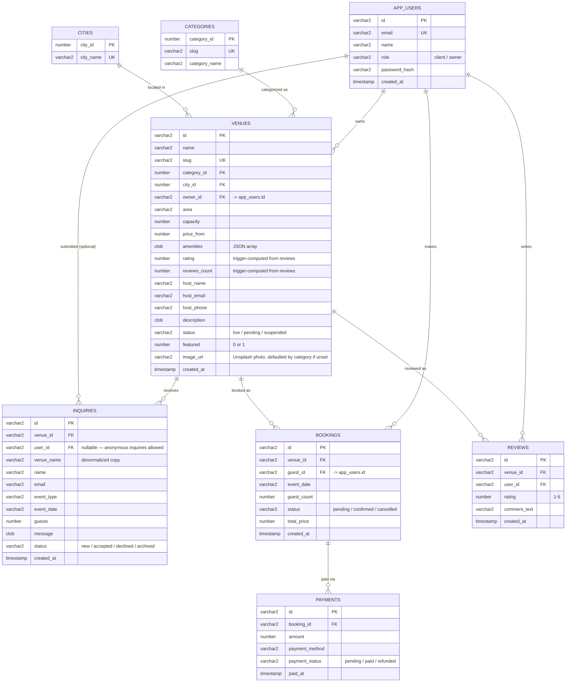

# MAHALDB — entity relationship diagram

This documents the schema actually in use by the running app (`MAHALDB`,
provisioned by [`provision_mahaldb.sql`](provision_mahaldb.sql)). It does
**not** cover `MAHAL_APP` (the earlier, superseded flat-schema attempt) or
`TEST` (a separate, pre-existing workspace/schema this project never
touches) — see [`CREDENTIALS.local.md`](CREDENTIALS.local.md) for how
those relate.

## How the write paths work

- **`venues_flat`** is a *view* (not shown above), not a table — it joins
  `VENUES` + `CATEGORIES` + `CITIES` back into one flat shape so the Node
  backend's REST calls don't need to know the schema is normalized
  underneath.
- Reads go through AutoREST against that view. **Writes don't** — Oracle
  rejects the `RETURNING ROWID` clause ORDS generates for inserts through
  a join view (`ORA-22816`), so venue creation goes through a small
  custom ORDS PL/SQL handler (`/venue-create/`, see
  `enable_rest_mahaldb.sql`) that resolves the category, looks up (or
  creates) the city, and inserts directly.
- `venues.rating` / `reviews_count` are **not** stored independently —
  they're maintained by a compound trigger (`reviews_sync_venue_rating`)
  that recomputes both from real rows in `reviews` on every insert/
  update/delete. A plain row-level trigger can't do this (Oracle raises
  `ORA-04091`, "table is mutating," if a trigger queries the table it's
  firing on), hence the compound trigger with a `BEFORE EACH ROW` /
  `AFTER STATEMENT` split.

## What's still deliberately not built

- **No booking, payment, or review *creation* flow in the app.** The
  tables and FKs exist and are seeded with sample data
  (`seed_reviews.sql`) so `venues.rating`/`reviews_count` are real, but
  there's no UI yet for a client to actually leave a review, make a
  booking, or pay a deposit — building that (plus e.g. Stripe
  integration) is separate, larger scope than "the schema exists."
- **`INQUIRIES.user_id`** is only populated when the submitter happens to
  be logged in (`optionalAuth` in the backend) — anonymous inquiries are
  still allowed and leave it `NULL`.
